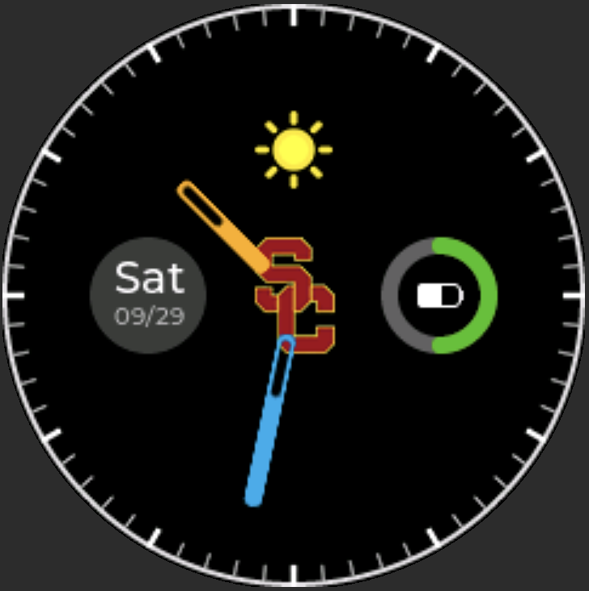

## Overview

`Neptune` is a project for a digital watch running on an embedded system. Here are the two previews of the prototypes. 


<p align="center">    </p>


## Build Project

### ARM-GCC

```bash
which arm-none-eabi-gcc      # /opt/homebrew/bin/arm-none-eabi-gcc
which arm-none-eabi-g++      # /opt/homebrew/bin/arm-none-eabi-g++
which arm-none-eabi-gdb      # /opt/homebrew/bin/arm-none-eabi-gdb
arm-none-eabi-gcc --version  
# arm-none-eabi-gcc (GNU Arm Embedded Toolchain 10.3-2021.07) 10.3.1 20210621 (release)
# Copyright (C) 2020 Free Software Foundation, Inc.
# This is free software; see the source for copying conditions.  There is NO
# warranty; not even for MERCHANTABILITY or FITNESS FOR A PARTICULAR PURPOSE.
```


### CMake & Make

**Debug**

```bash
mkdir build
cd ./build
cmake -DCMAKE_BUILD_TYPE=Debug .. && make -j32
```


**Release**

```shell
mkdir build
cd ./build
cmake -DCMAKE_BUILD_TYPE=Release .. && make -j32
```


